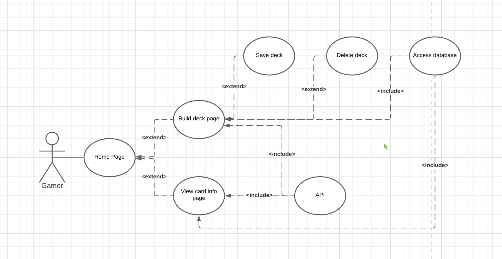
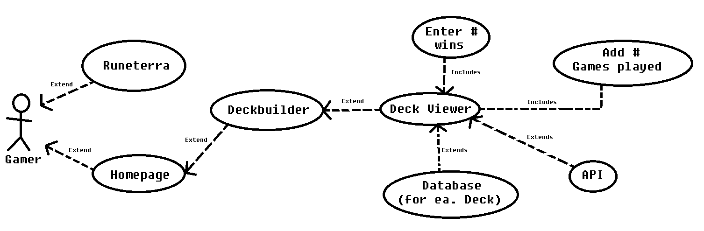
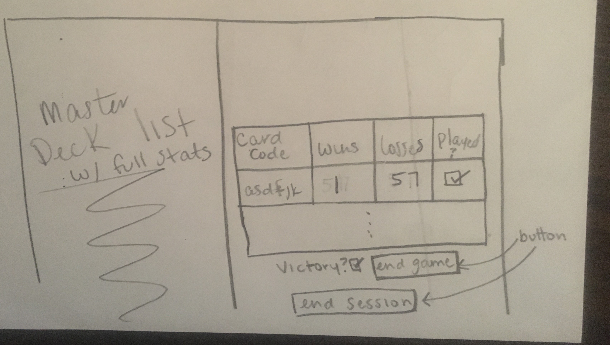

# Legends of Runeterra StatTracker

A program for keeping track of the popularity of cards.

To activate the env on unbuntu use: source env/bin/activate

<h2 align="center">Prototype Description</h2>

- A user interface for the user to choose their options

	- Building and naming new decks

		- The user can build custom decks.

			- Users will add cards to the deck one at a time from a library of cards available from the [API](https://developer.riotgames.com/docs/lor).

			- The program will keep track of deck size and space left.

			- The program will monitor the deck for any errors with its structure including validity and size and will notify the user if errors become apparent.

			- The program will not let the user add cards that are out of the parameters of legal deck building.

			- The user can cancel to stop building their deck

			- The user can confirm the deck to save it.

		- Decks will be viewable in an inventory page for the user to browse and explore.

			- Existing decks can be edited to add or remove cards.

			- Decks can be deleted.

	- Save/restore deck(s)

		- The user can store their decks with reference to each card's information, and then restore the decks for later use

	- View stats

		- The user can choose a card from the API and view it's information/stats

- Database to hold card information

	- CSV

	- Holds card information that is valuable to the user

	- Database structured to make it easy to see which cards are more popular to use and what cards work well together

- Web interface

	- Built with flask

	- Simple to use without having to download any software

	- Accessible with any major web browser that the user has

	- 4 main pages:

		- Building a deck

		- Importing/exporting decks

		- Browsing card information

		- Viewing information/stats

- Card information

	- Name of the card

	- Costs

	- 'Stats'

	- Ratio of use in gameplay

	- win/loss percentage

	- Common cards used together

<h2 align="center">Use Case Diagram</h2>

<h2 align="center">Use Case Diagram (Database)</h2>

<h4 style = "text-align: center;">Potential Plan for Transferring to a Database:</h4>

The import package used in python is SQLAlchemy, part of flask. 

This allows us to create and refer to a database (outlined below) created through SQLite. SQLite is part of python 3 (and above) - eliminating the need to download extra software; the lite version eliminates the need for servers (and etc...). Instead of creating the database from scratch, we will be able transfer our already existing csv files to the database. 
Both creating the database and importing the csv files will be done through python. Currently, our deck building page creates decks as csv files - this makes translating them to the database with our current code simpler. Potentially, we can alter the code later to link to the database, so the decks are directly added upon creation. 

The database will have a ‘master list’ that contains every card in Runeterra’s API (that we’ve collected thus far) and contains the following: 

- Card code
- Number of wins
- Number of losses 
- Pending others?

The database will also refer to the decks created by a user with an identical layout - with one exception (explained below). There potentially will be an added column for 'WinRate'. The database will be accessed through the deckbuilder page. It will be used to keep track of how many wins and losses each deck has, marking which cards were used - incrementing their count accordingly. This ratio of wins/losses per card will then be transferred to the ‘master list’. Perhaps this transfer can be done after a ‘gaming session’ is completed - making it easier to record data as the user plays?

<u> Suggestion(s) for implementing this: </u>

- The user can increment wins/losses for each card, added directly to the ‘master list’
- The user can incremenet wins/losses for an entire deck... in the ‘current deck’:
	- Toggle option: (next to each card) Tells the system that what was played in game
	- Toggle option: (below table) Tells the system if the user won
	- Button: Tells the system that a game was completed
		- [ACTION] Store the data/stats derived from game directly to ‘current deck’s’ stats list
	- Button: Tells the system that the user has completed a game session
		- [ACTION] Transfers ‘current deck’s’ wins/losses to ‘master list’
		- [ACTION] Resets wins/losses columns to 0

(I'm a visual person, so in case it helps, here's an example of what I kind of had in mind:)

** The only reason I didn't draw in the other details that are already part of the deckbuilder page was just to keep it simple :) **

Potential problem: The win rate wouldn’t be stored for each individual deck. We could add a column titled ‘WinRate’ unique to the built decks and stored the 
percentage of wins/games played - which is ignored during the transfer to the 'master list'. This would then add one more [ACTION] after 'game session' is completed: calculating the percentage of wins versus games played and incrementing applying it to the 'winrate' column (or there could be four columns: Wins, Losses, Total wins, Total losses).

Pending: implementation to determine which cards work best with which.

<h4 style = "text-align: center;">Resources for reference:</h4>

$ pip install sqlalchemy

<a href="https://www.youtube.com/watch?v=Z1RJmh_OqeA&ab_channel=freeCodeCamp.org"> Flask Tutorial (around 15:00 for database) </a>

<a href="https://www.youtube.com/watch?v=o-vsdfCBpsU&ab_channel=sentdex"> Create SQLite (Video) </a>

<a href="https://www.sqlitetutorial.net/sqlite-cheat-sheet/"> SQLite Cheat Sheet </a>

<a href="https://www.kite.com/python/answers/how-to-insert-the-contents-of-a-csv-file-into-an-sqlite3-database-in-python"> Adding CSV to Database </a>

<a href="https://www.tutorialspoint.com/sqlalchemy/sqlalchemy_core_sql_expressions.htm"> SQLAlchemy </a>
